# AMT_Pinecone TYPO3 Extension

[](https://get.typo3.org/version/12)

### AMT_Pinecone is a TYPO3 extension designed to enhance your search capabilities by providing semantic search functionality integrated with TYPO3 instance and Pinecone.

### What is Semantic Search?

Semantic search goes beyond traditional keyword matching by understanding the meaning behind the query. Instead of just looking for exact matches of search terms, it interprets the context and intent of the query, providing more accurate and relevant results based on the relationships between words and concepts. This approach improves the quality of search results, especially when dealing with complex queries or unstructured data.

### How It Works?

The AMT_Pinecone extension leverages the Pinecone API to implement semantic search. It uses vector embeddings generated by the OpenAI API to represent data in a way that captures semantic relationships. By indexing TYPO3 records and querying these vector representations, the extension ensures that users get the best matches, even if the query terms do not exactly match the content.

### Key Features:
- **Accurate and Fast Search**: Semantic search delivers better, context-aware results compared to traditional keyword search.
- **Customizable Configuration**: Define which TYPO3 tables and fields to index for semantic search.
- **OpenAI Embeddings**: Uses OpenAI API to generate vector embeddings for indexing content.
- **Pinecone API**: Implements vector search through Pinecone for efficient data retrieval and indexing.
- **Dynamic Synchronization**: Synchronizes indexed data with TYPO3 records (commands or automatic scheduler task).
- **User Interface**: A clean and intuitive UI for managing the indexing process and search queries.

### Requirements:
- TYPO3 version 12
- Active API's keys for OpenAI and Pinecone

### Installation:
1. Install the **AMT_Pinecone** extension using the standard TYPO3 installation method.
2. After installation, ensure the extension is active. It's, icon will appear in the left panel.
3. Go into Settings backend module and next Configure extensions page.
4. Click amt_pinecone list of extension configuration and add configuration variables:
- required fields: 
  - OpenAI API key 
  - OpenAI model for embeddings (we recommend using models: _text-embedding-3-small_ or _text-embedding-3-large_)  
  - Pinecone API key
  - Pinecone API index name
5. Click the extension icon to start using it.

### Usage:
1. Configure the tables and fields to be indexed for semantic search (Web -> List backend module)
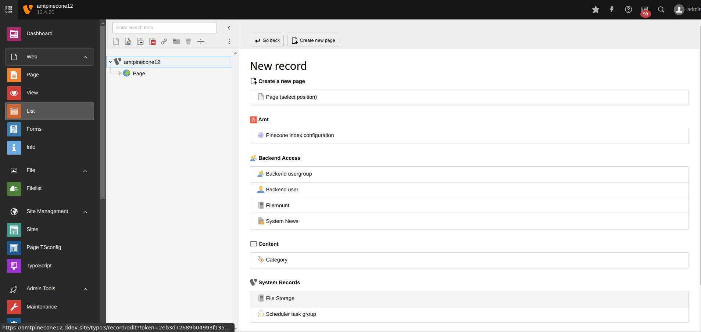
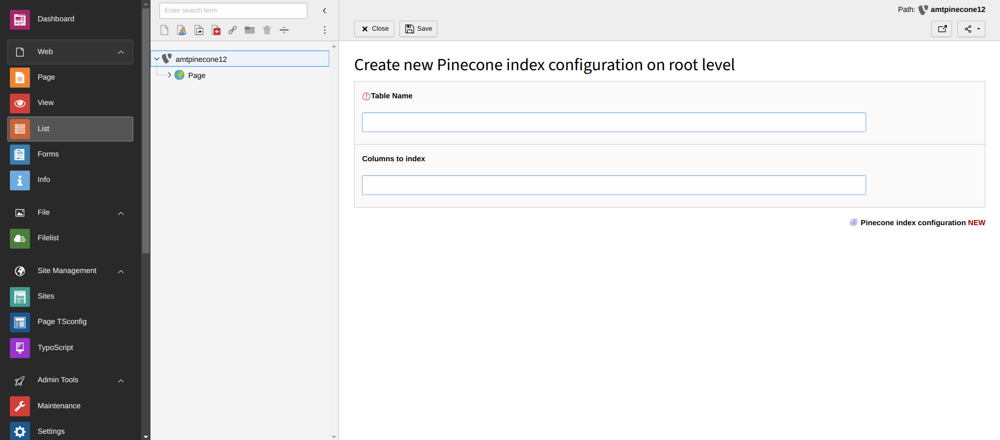
2. Perform searches and get the best possible results based on semantic understanding.
3. Customize settings like the token limit for OpenAI and indexing settings as needed.
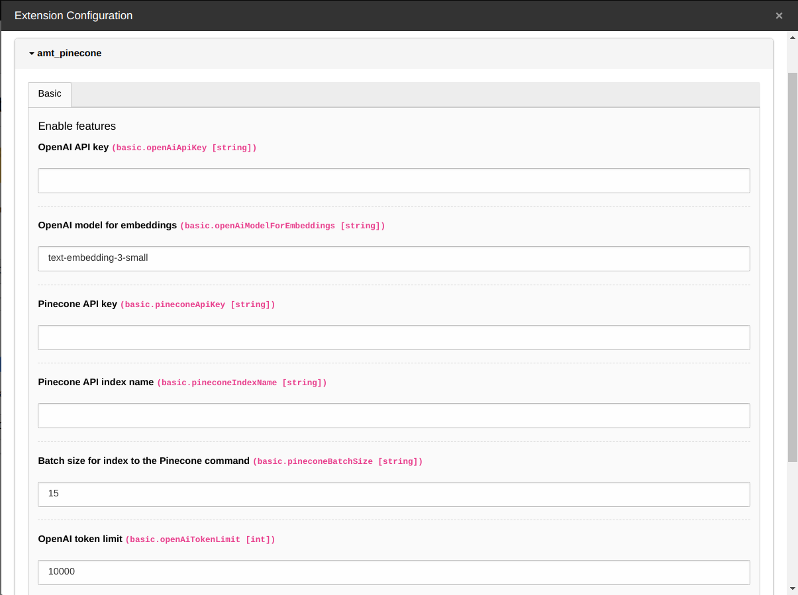
4. Configure the AMT_Pinecone ViewHelper as needed. It provides two configurable variables for customizing the search configuration:
- count - number of results which should be return in the view
- table - name of tables which should be use to semantic search (as default or empty, then all tables are used to search records)

**PineconeSearchViewHelper** class - here you can change the values of the _**count**_ or _**table**_ variables to customize search to your preferences.
```php
    public function initializeArguments(): void
    {
        $this->registerArgument('query', 'string', 'Search query from the user input', true);
        $this->registerArgument('count', 'int', 'Number of results to return', false, 10);
        $this->registerArgument('table', 'string', 'Table name to search from', false, '');
    }
```

**Semantic search** - select table to search
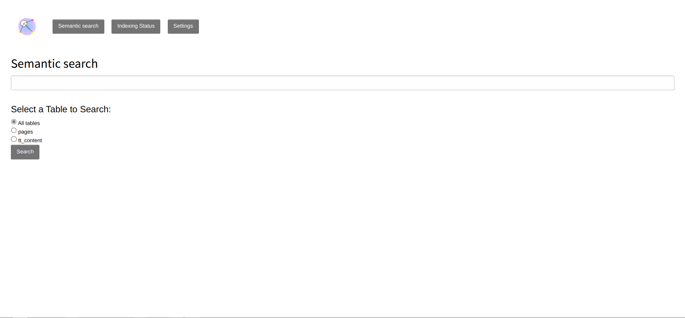

**Search ViewHelper fluid - example of usage:**
```html
{namespace ext=Amt\AmtPinecone\ViewHelpers}
<f:for each="{ext:pineconeSearch(query: 'example', count: 10, table: 'pages')}" as="result">
    <tr>
        <td>{result.id}</td>
        <td>{result.metadata.uid}</td>
        <td>{result.metadata.tablename}</td>
        <td>{result.score}</td>
    </tr>
</f:for>
```
**Results from example:**
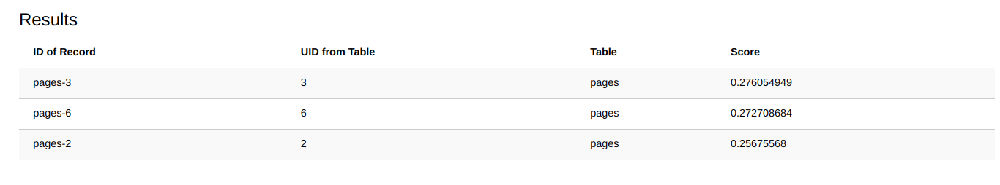

### Extension usage

#### Main page of extension:
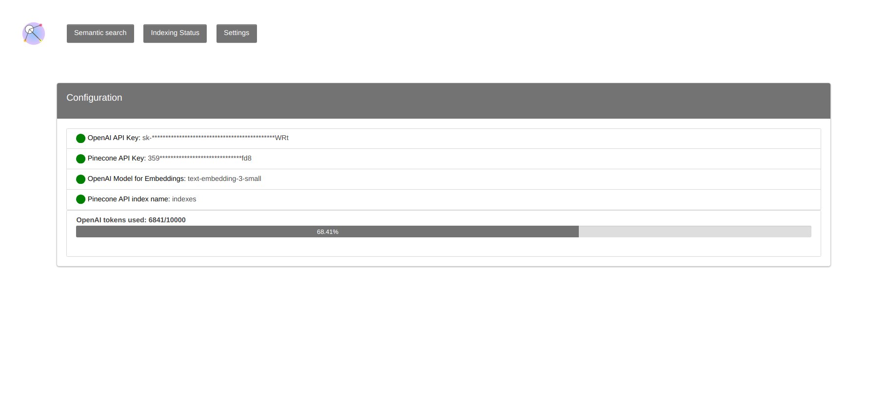

#### Search view:


#### Indexing status:
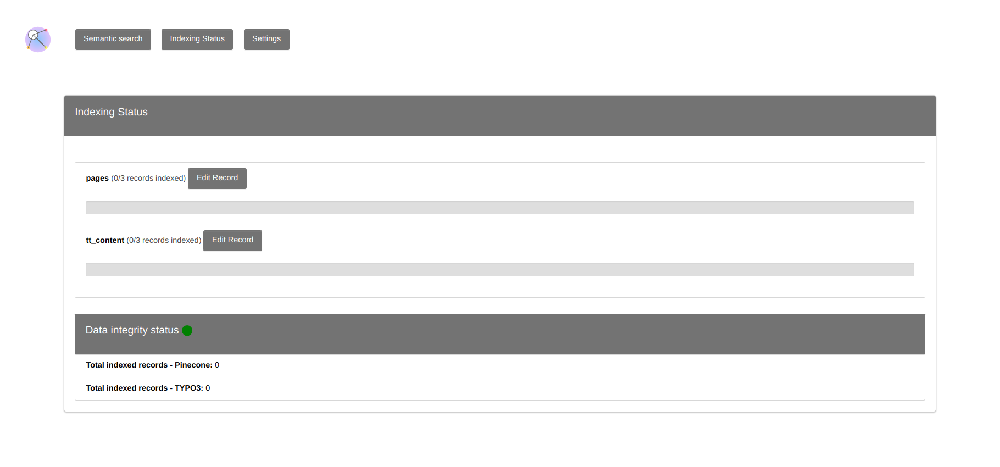

#### Settings page:
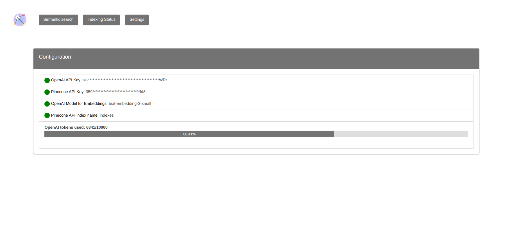

#### Scheduler - commands to index/check integrity of data
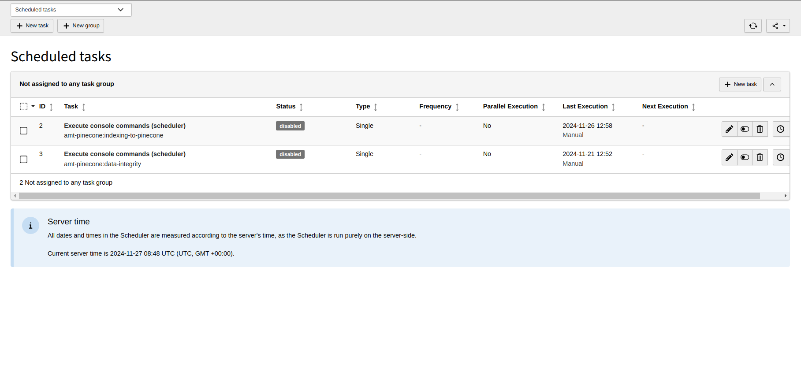

#### Edit config index record form
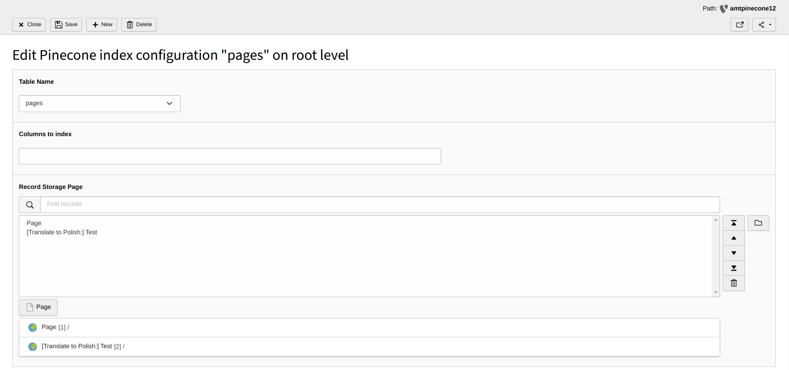

#### Semantic search and results
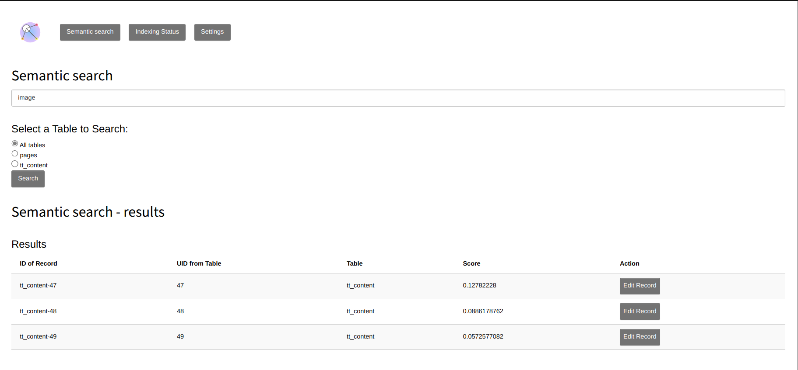

### FAQ
1. What are embeddings and why I should use OpenAI? 
This link takes you to the OpenAI documentation and explains exactly, what embeddings are and what models are currently supported 
https://platform.openai.com/docs/guides/embeddings/embedding-models
2. How to generate API key and create an index in the Pinecone?
Go to you Pinecone Account main Page (Get Started section) and click Generate API key - follow the instructions on the screen.
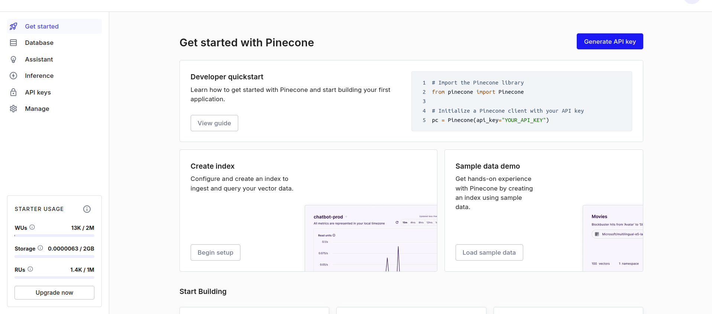

Go to Database section and click Create index button. We recommend to use a Serverless indexes.
https://docs.pinecone.io/guides/indexes/understanding-indexes
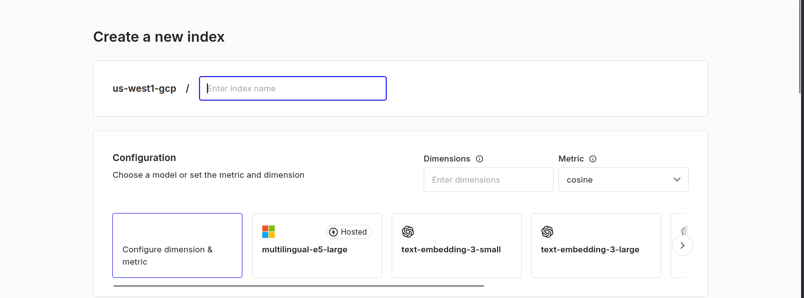

### Changelog:
- 0.1.0: Initial release
